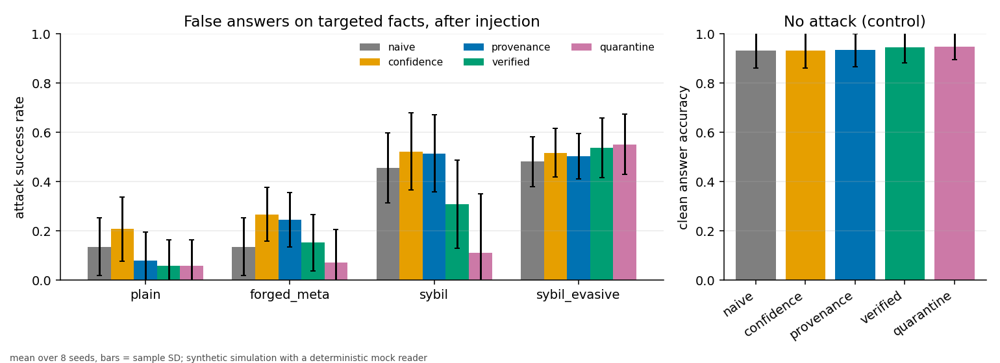
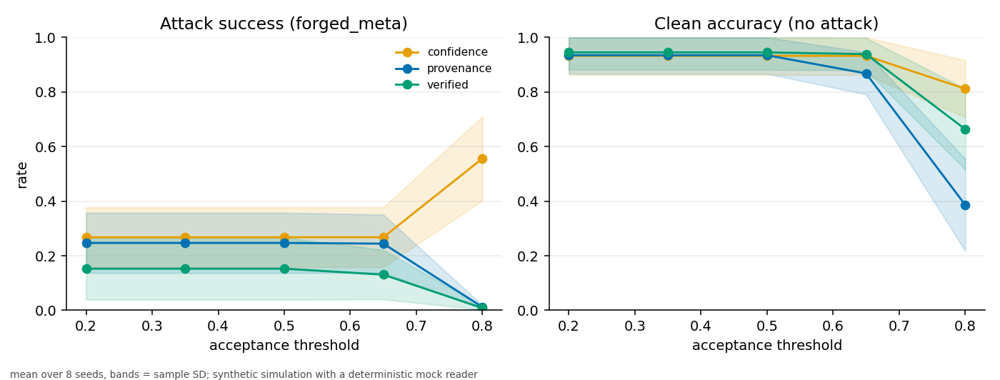

# Research note: an empirical exploration of provenance-aware agent memory

Farzam Nikbakhsh Jorshari. Status: exploratory, single simulator, mock reader. Every number
below is computed from `results/quick/raw_runs.csv` or its generated aggregate
`results/quick/summary.csv`. Both are produced by
`python -m provmem bench --profile quick` (8 evaluation seeds, 1000-1007,
275 configurations, 2,200 runs). Nothing here is claimed to be novel; provenance tracking,
trust scoring and quarantine are all old ideas. The contribution, such as it is, is a small
reproducible testbed and an honest reading of what it shows.

## 1. Question

**Hypothesis (H).** Agent memory that records and reasons over provenance can reduce the
influence of corrupted or unreliable memories while retaining useful information.

I split H into four checkable parts:

* H1: the false claim is retrieved less often and changes fewer answers.
* H2: it spreads less through honest relaying.
* H3: useful (clean) answers are not sacrificed.
* H4: the answer to H1 depends on how much of the provenance the adversary can forge.

## 2. Setup in one paragraph

Six agents gossip about 45 invented facts (fictional stations, planets, guilds). Each fact
is observed first-hand by two honest agents, with a 2% honest error rate. At round 3 one
faulty agent injects coordinated false claims about 6 target facts to 2 seed agents, once.
Each round every honest agent answers questions about the 6 targets and 8 clean control
facts through one of five retrieval strategies and a deterministic mock reader. Full
definitions: `docs/memory_model.md`. Adversary tiers: `docs/threat_model.md`.

Defaults were fixed in advance and not tuned: threshold 0.5, k = 3, verifier coverage 0.5,
trust weights (evidence 5, confidence 2, hop 3, agreement 6, recency 2).

**How to read the numbers.** Tables report means over the same 8 seeded simulator runs;
`summary.csv` also reports the sample standard deviation across seeds. Those spreads describe
sensitivity to changes in the synthetic world, target selection and gossip draws. They are not
confidence intervals and the seeds are not independent observations of real agent systems. I use
no significance tests. In the no-attack control the "attack success rate" (wrong-valued answers
on the target facts) is not zero (0.05 to 0.08) because honest errors exist.

## 3. Results

### 3.1 Strategies against four adversary tiers

Mean over 8 seeds; sample standard deviations are in `summary.csv`. ASR = attack success rate after
injection. Propagation counts only spread that
went through honest relaying. FN-accept = share of injected false entries the policy accepts.

| tier | strategy | ASR | false retrieved | propagation | FN-accept | clean acc. |
|---|---|---|---|---|---|---|
| none (control) | naive | 0.053 | 0.119 | n/a | n/a | 0.932 |
| none (control) | quarantine | 0.060 | 0.077 | n/a | n/a | 0.949 |
| **plain** | naive | 0.136 | 0.711 | 0.425 | 1.000 | 0.941 |
| plain | confidence | 0.208 | 0.711 | 0.425 | 1.000 | 0.941 |
| plain | provenance | 0.080 | 0.122 | 0.000 | 0.000 | 0.945 |
| plain | verified | 0.058 | 0.080 | 0.000 | 0.000 | 0.963 |
| plain | quarantine | 0.059 | 0.079 | 0.000 | 0.000 | 0.947 |
| **forged_meta** | naive | 0.136 | 0.711 | 0.425 | 1.000 | 0.941 |
| forged_meta | confidence | 0.268 | 0.711 | 0.425 | 1.000 | 0.941 |
| forged_meta | provenance | 0.247 | 0.711 | 0.425 | 1.000 | 0.946 |
| forged_meta | verified | 0.153 | 0.432 | 0.271 | 0.736 | 0.966 |
| forged_meta | quarantine | 0.071 | 0.129 | 0.046 | 0.114 | 0.939 |
| **sybil** | naive | 0.457 | 0.841 | 0.588 | 1.000 | 0.958 |
| sybil | confidence | 0.523 | 0.841 | 0.588 | 1.000 | 0.958 |
| sybil | provenance | 0.515 | 0.841 | 0.588 | 1.000 | 0.958 |
| sybil | verified | 0.309 | 0.490 | 0.350 | 0.730 | 0.975 |
| sybil | quarantine | 0.111 | 0.135 | 0.062 | 0.115 | 0.946 |
| **sybil_evasive** | naive | 0.482 | 0.828 | 0.596 | 1.000 | 0.923 |
| sybil_evasive | provenance | 0.504 | 0.828 | 0.596 | 1.000 | 0.931 |
| sybil_evasive | verified | 0.537 | 0.819 | 0.592 | 1.000 | 0.948 |
| sybil_evasive | quarantine | 0.552 | 0.832 | 0.596 | 1.000 | 0.964 |



What this says, and what it does not:

* **Provenance metadata alone helps against a sloppy fabricator and not against a careful
  one.** With `plain` forgery (a citation to a document that does not exist) the provenance
  strategy cuts the false-retrieval rate from 0.711 to 0.122 and stops honest relaying of
  the false claims (propagation 0.425 to 0.000). With `forged_meta` (valid document
  reference, confidence 0.99, hop 0, impersonated origin) it does **nothing** to retrieval
  (0.711 to 0.711), and its ASR is above naive (0.247 against 0.136). The paired difference is
  +0.110 ± 0.043 (sample SD) and is positive in all eight seeds. That makes the direction
  consistent inside this simulator, not established for real agents. The mechanism is visible:
  the reader weights votes by trust, the forged entry has *higher*
  trust than honest ones because every field it can write is written well, and so a
  forgeable signal becomes a vote multiplier for the attacker.
* **Confidence never helped.** It was the worst strategy in the first three attack tiers
  (0.208, 0.268, 0.523) and never better than naive, consistent with the assumption that a
  source can state any confidence it likes.
* **Fabricated identities break agreement.** Under `sybil` (3 fake origins against 2 honest
  sources) the provenance strategy is no better than naive (0.515 against 0.457).
* **Independent verification helps in proportion to coverage.** With half the facts checkable
  it cuts acceptance of the false entries by about a quarter (FN-accept 0.736) and lowers ASR
  to 0.153 (forged_meta) and 0.309 (sybil).
* **Quarantine is where most of the gain came from** in these tiers (forged_meta 0.071,
  sybil 0.111, near the control's 0.05 to 0.08), and it limited secondary propagation to
  0.046 and 0.062. Section 3.4 shows why.
* **An adversary that avoids the verifier's coverage defeats all of it.** In `sybil_evasive`
  every strategy sits at 0.48 to 0.55, and quarantine is not better than naive.

Recovery time. `recovery_rounds` is rounds after injection until ASR is <= 0.05 and stays
there (`recovered` is the share of seeds that did). Plain forgery: naive 6.1 rounds with 50% of
seeds recovering, confidence never, provenance 2.75, verified and quarantine 2.4 (75%). The 0.05
cut-off is close to the control's own ASR (0.05 to 0.08), so this metric is partly noise and I
would not read the differences between the three defended strategies as meaningful. Under
forged_meta only quarantine recovers (2.4 rounds, 75% of seeds); verified recovers in 12.5%.

### 3.2 Utility: were useful memories kept?

At the default threshold, mean utility is similar across strategies in these runs. In the
no-attack control clean accuracy is 0.932 (naive) to 0.949 (quarantine), and true entries
rejected are 0.000 to 0.003. Costs appear elsewhere:

* **Threshold** (`threshold` experiment, forged_meta). For the provenance strategy, thresholds
  0.2 to 0.5 give the same ASR 0.247 (nothing is rejected that matters). Raising it to 0.65
  rejects part of the injected set (FN-accept 0.224) but ASR barely moves (0.244) and no-attack
  clean accuracy drops to 0.868, with 4.2% of true entries rejected. At 0.8, ASR is 0.012 but
  clean accuracy is 0.386 and the reader abstains 61.6% of the time: the defence "works" by
  refusing to answer. There is no threshold on this curve that gives near-zero ASR and
  near-baseline utility for provenance-only scoring against forged metadata.

  

* **Confidence thresholds invert.** At 0.8 the confidence strategy's ASR rises to 0.556 (from
  0.268), because it now discards honest entries (stated confidence 0.7 to 0.95) and keeps the
  attacker's 0.99.
* **Hop cut-off** (`max_hops`). Forbidding anything beyond one relay lowers forged_meta ASR from
  0.247 to 0.189 but rejects 10.4% of true entries in the control and costs about 3.6 points of
  clean accuracy. Cut-offs of 2 or more make little difference in this eight-seed run
  (rejections <= 0.5%).
* **Verifier noise** (`coverage` experiment). With quarantine, 10% verifier error takes
  forged_meta clean accuracy from 0.939 to 0.840 and true-entry rejection from 0.030 to 0.181; at
  20% error, 0.690 and 0.359. Plain verification degrades less (0.966 to 0.945 to 0.902). The
  cascade amplifies verifier mistakes.
* **Collateral from impersonation.** Under forged_meta, quarantine rejects 3.0% of true entries
  (control 0.3%). The cascade quarantines the impersonated honest agent's other entries.

### 3.3 Which provenance field matters? (ablation)

`ablation` experiment, provenance strategy, drop-one and only-one variants (full table in
`results/quick/report.md`).

| variant | plain: false retrieved / FN-accept | forged_meta: false retrieved / FN-accept | sybil: ASR |
|---|---|---|---|
| full | 0.122 / 0.000 | 0.711 / 1.000 | 0.515 |
| drop evidence | **0.524 / 0.203** | 0.596 / 0.627 | 0.517 |
| drop confidence | 0.122 / 0.000 | 0.711 / 1.000 | 0.502 |
| drop hop | 0.121 / 0.000 | 0.711 / 1.000 | 0.528 |
| drop agreement | 0.487 / 0.000 | 0.711 / 1.000 | 0.515 |
| drop recency | 0.121 / 0.000 | 0.711 / 1.000 | 0.501 |
| only agreement | 0.053 / 0.000 | **0.053 / 0.000** | 0.584 |
| only evidence | 0.121 / 0.000 | 0.711 / 1.000 | 0.484 |
| only confidence | 0.711 / 1.000 | 0.711 / 1.000 | 0.523 |

* **Against the fabricator, evidence resolvability carries the score.** Dropping it raises false
  retrieval from 0.122 to 0.524, leaves 20.3% of injected entries accepted at the final snapshot, and
  raises ASR from 0.080 to 0.192. Dropping agreement also raises false retrieval (0.487) but the
  final-snapshot acceptance stays at 0 and ASR stays at 0.080, so evidence is the decisive field here
  and agreement a secondary one.
* **Against the forger, evidence *hurts*.** Forged entries have perfect evidence, so dropping
  it lowers FN-accept from 1.000 to 0.627. The field discriminates in the wrong direction once
  the attacker can copy a valid reference.
* **Agreement is the only field that worked against a single-attacker forger**, and it does so
  only when used alone (`only_agreement`: 0.053 with FN-accept 0.000). In the full weighted mean it is
  outvoted by the four forgeable fields (total weight 12 against 6). It also relies on a
  knife-edge: two honest origins against one false origin score exactly 0.5, the default
  threshold. And it fails once the false claim has more distinct origins than the honest one
  (`sybil` 0.584; and see the agreement grid below).
* **Confidence contributes nothing, or worse; recency and hop contribute little.** `only_recency`
  is degenerate (recency at round 10 for round-0 entries is 0.42, below the threshold, so it
  rejects everything old; clean accuracy 0.31): it measures the threshold, not the field.
* This ablation is for provenance scoring at a fixed threshold and fixed weights. It says which
  field carries *this* score under *these* attackers, not which field is intrinsically valuable.

### 3.4 What the quarantine mechanism is made of

| variant | forged_meta ASR | forged_meta FN-accept | sybil ASR |
|---|---|---|---|
| full | 0.071 | 0.114 | 0.111 |
| no cascade | 0.145 | 0.736 | 0.307 |
| no retraction | 0.071 | 0.114 | 0.111 |
| no audit | 0.080 | 0.114 | 0.120 |

The origin-suspicion cascade explains nearly all of quarantine's gain over plain verification:
it turns a few refutations on covered facts into protection for entries about uncovered facts
by punishing a repeated origin identity. The audit sweep changes the forged-meta ASR by a paired
mean of +0.009 ± 0.015 (sample SD). **Retractions had no effect in these runs**: outputs are
identical to the full mechanism. That is structural in this simulator, not a finding about
retractions in general:
retractions only originate from refutations, refutations require archive coverage, and
coverage is global, so every recipient can refute the claim itself. The quorum path, which is
meant for uncovered facts, is never triggered. Cascade also needs at least two refutations
from one origin: at coverage 0.25 quarantine is no better than nothing (ASR 0.258 against
0.247), at 0.5 it is 0.071.

The cascade is also the reason `sybil_evasive` is a limit test: an attacker that never gets
refuted never gets punished.

### 3.5 Other factors

**Source agreement** (8 agents, forged_meta; ASR, rows = honest sources, columns = colluding
faulty agents; each colluder impersonates a different honest agent):

| strategy | 1 honest / 1 faulty | 1 / 3 | 3 / 1 | 3 / 3 |
|---|---|---|---|---|
| naive | 0.346 | 0.821 | 0.040 | 0.448 |
| provenance | 0.594 | 0.925 | 0.078 | 0.490 |
| verified | 0.373 | 0.541 | 0.039 | 0.296 |

More honest sources help everything; more colluders hurt everything. Provenance-only scoring was
never better than naive in this grid (its point estimate is higher in all nine cells). The
verified strategy is the only one that keeps 1 honest against 3 colluders below 0.6.

**Number of agents** (4, 6, 10, 16; forged_meta, naive ASR 0.182, 0.136, 0.143, 0.034). ASR falls with
more agents even for naive retrieval, because the attacker's reach is fixed at 2 seed agents and
the honest pool grows. I did not vary the attacker's reach with the population, so this is not
evidence that scale is protective. Verifier lookups grow roughly linearly (about 200 at 6 agents
to about 625 at 16 for verified). Gossip messages also grow linearly, since fanout is fixed; quarantine
adds 18% to 21% more messages in forged_meta runs (at 6 agents, 152 to 179.5) and 43% in sybil runs
(217.6), from retraction broadcasts.

**Retrieval k.** At k = 1 the top hit is believed: naive false-retrieval and ASR are both 0.349
under forged_meta. At k = 3, a plurality vote among retrieved entries brings naive ASR down to
0.136 even though false entries are retrieved 0.711 of the time. Values k = 5 and 8 give identical rates to k = 3, because in the forged_meta
scenario an agent holds at most three entries about a fact (two honest origins and one forged); only the
token cost grows. Provenance-
weighted voting does not get the same dilution benefit (0.247 at k = 3).

### 3.6 Overhead

| strategy | tokens per query (no attack) | vs naive | candidates scored per query | verifier lookups per run |
|---|---|---|---|---|
| naive | 36.7 | 1.00x | 3 | 0 |
| confidence | 39.7 | 1.08x | 12 | 0 |
| provenance | 51.7 | 1.41x | 12 | 0 |
| verified | 54.7 | 1.49x | 12 | 196 |
| quarantine | 54.7 | 1.49x | 12 | 198 |

Tokens are whitespace tokens of the question and rendered context. Provenance annotations are
most of the growth. Candidate scoring is 4x because the pool is 4k. At k = 8, provenance reaches
125 tokens per query against 85 for naive. The runs made about 700 queries each, so verified costs
about 0.28 archive lookups per query at 50% coverage. Wall-clock time was not measured; the
scoring is a handful of dictionary lookups per candidate, while the cost of a real archive lookup
depends on its implementation and cannot be inferred from this simulation.

## 4. Verdict on H

* **H1, fewer false retrievals and changed answers: yes against naive fabrication; no for
  provenance metadata alone against a forger; yes with independent verification plus quarantine on
  facts the verifier can reach.** The strongest and most consistent gains here come from the
  unforgeable check and the cascade, not from the metadata fields.
* **H2, less propagation: yes when the defended agent refuses to relay what it would not
  retrieve** (plain: 0.425 to 0.000; forged_meta with quarantine: 0.046), and no when the
  metadata is good enough to pass the filter.
* **H3, retaining useful information: yes at the default threshold and with a perfect verifier;
  visible costs at thresholds of 0.65 and above, with verifier noise, and under impersonation.**
* **H4, dependence on forgeable provenance: strongly yes.** The tiers order the strategies
  differently. That ordering is the main result.

So: provenance as *stored and scored metadata* is a weak defence whose value scales with the
attacker's laziness. Provenance as an *index for where to spend independent verification, and
for propagating distrust to an origin*, is the part that held up, with the caveats below.

## 5. Threats to validity

1. **Mock reader.** A deterministic weighted plurality reader obeys `w=` perfectly and cannot
   be persuaded. A real LLM might ignore annotations (weakening provenance-aware prompting) or
   be swayed by fluent false text regardless of weight. Nothing here transfers to real models
   without re-measurement.
2. **Oracle verifier and global coverage.** The verifier is exactly right on covered facts.
   Real verification (a KB, a tool, another model) is noisy, biased and correlated with the
   attacker. Verifier noise experiments show the cascade is fragile to it.
3. **Structured claims, accurate extraction, inert facts.** Real memory is text.
4. **Small world, few seeds.** There are 45 facts and 8 seeds. The sample standard deviations in
   `summary.csv` quantify variation under this simulator only; they are not confidence intervals
   over real systems. I report no p-values or general-population inference.
5. **Single default configuration.** Weights, thresholds, decay constants and attacker knobs were
   hand-set and not swept jointly. The threshold, hop, coverage, agent and k sweeps are one factor
   at a time.
6. **Weak held-out discipline.** Seeds 1000+ were not used for any decision, but the simulator is
   small and I looked at seeds 0 and 1 across strategies during development, and chose gossip
   volume from no-attack accuracy on seeds 0 to 3.
7. **Attacker adaptation is minimal.** One adaptive behaviour (avoid coverage), no probing of
   thresholds, no retraction abuse, no reputation building.
8. **Ablation and metric artefacts.** `only_recency` is degenerate; `only_agreement` sits on a
   threshold boundary; the recovery cut-off is near the control noise floor; retractions are
   structurally inert here; changing the number of agents changes attacker dilution as well.
9. **Static facts.** Recency is untested against a changing truth.

## 6. What I would do next

In order: run `OpenAICompatibleLLM` against a local open-weights model with and without the
`w=` annotations; replace the hashing embedder; make provenance unforgeable with signatures and
measure what is left; replace the oracle verifier with a noisy, attacker-correlated one; add a
retraction-abuse attacker; sweep attacker reach with population size. See
`docs/learning_roadmap.md`.

## 7. Reproduce

```bash
pip install -e ".[dev]"
python -m pytest
python -m provmem bench --profile quick --out results/quick   # a few minutes with 4 workers
python -m provmem report --dir results/quick                   # regenerates plots and report.md
```

Same seeds give byte-identical CSVs (`tests/test_experiments.py`).
